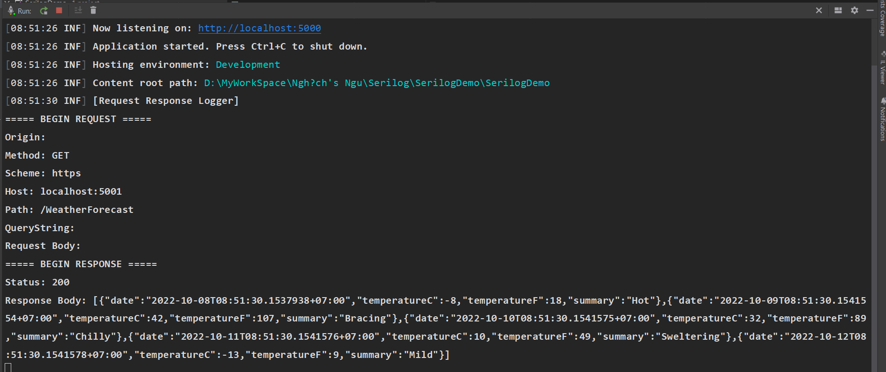
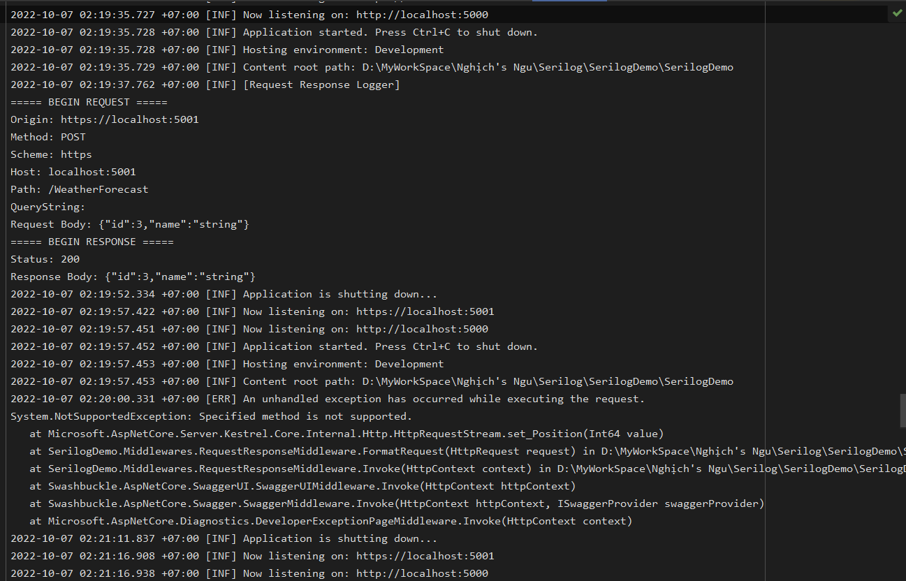
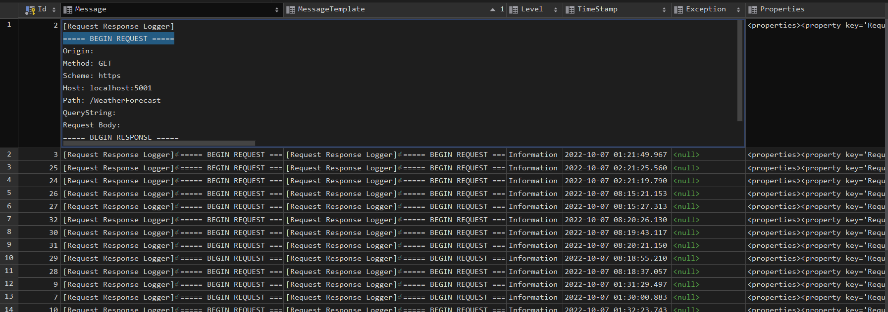
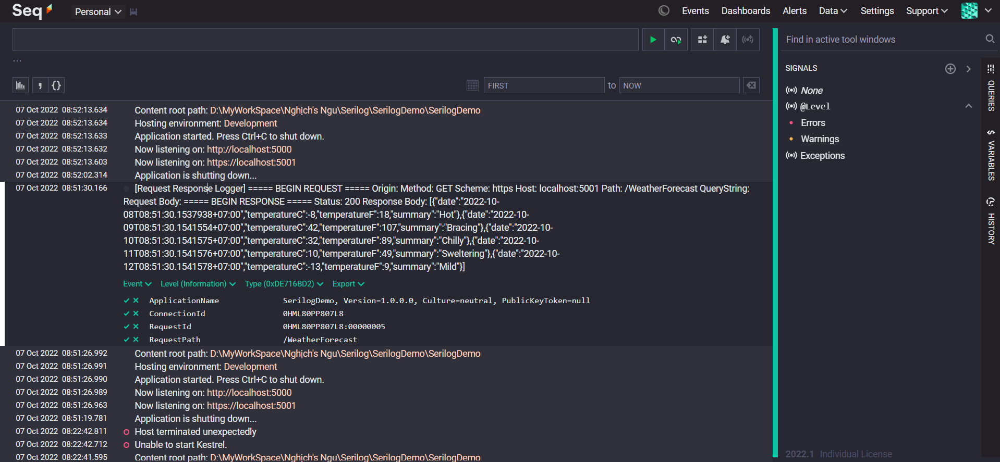

# This is my serilog demo ASP.NET 5.0

## Serilog

Serilog is a diagnostic logging library for .NET applications. It is easy to set up, has a clean API, and runs on all recent .NET platforms. While it's useful even in the simplest applications, Serilog's support for structured logging shines when instrumenting complex, distributed, and asynchronous applications and systems.

## Nuget Package

- [Serilog.AspNetCore ](https://www.nuget.org/packages/Serilog.AspNetCore/6.0.1)
- [Serilog.Settings.Configuration](https://www.nuget.org/packages/Serilog.Settings.Configuration/3.4.0)
- [Serilog.Expressions](https://www.nuget.org/packages/Serilog.Expressions/3.4.0)
- [Serilog.Sinks.MSSqlServer](https://www.nuget.org/packages/Serilog.Sinks.MSSqlServer/5.8.0)
- [Serilog.Sinks.Seq ](https://www.nuget.org/packages/Serilog.Sinks.Seq/5.2.1)

## Setup

First, you need to setup your `appsettings.json`

```json
{
  "Serilog": {
    "MinimumLevel": {
      "Default": "Debug",
      "Override": {
        "Microsoft.Hosting.Lifetime": "Information",
        "Microsoft": "Warning",
        "System": "Error"
      }
    },
    "WriteTo": [
      {
        "Name": "Console"
      },
      {
        "Name": "File",
        "Args": {
          "path": "Logs/log.txt",
          "restrictedToMinimumLevel": "Information"
        }
      },
      {
        "Name": "Seq",
        "Args": {
          "serverUrl": "http://localhost:5341",
          "apiKey": "1J306FjmWg1mI3iMe2WY",
          "restrictedToMinimumLevel": "Information"
        }
      },
      {
        "Name": "Logger",
        "Args": {
          "configureLogger": {
            "Filter": [
              {
                "Name": "ByIncludingOnly",
                "Args": {
                  "expression": "@m like '[Request Response Logger]%'"
                }
              }
            ],
            "WriteTo": [
              {
                "Name": "MSSqlServer",
                "Args": {
                  "connectionString": "Server=.;Database=SerilogDB;UID=sa;PWD=123456",
                  "tableName": "Logs",
                  "autoCreateSqlTable": true
                },
                "restrictedToMinimumLevel": "Information"
              }
            ]
          }
        }
      }
    ]
  }
}
```

Then, configure Serilog in your `Program.cs`

```csharp
var configuration = new ConfigurationBuilder()
                .SetBasePath(Directory.GetCurrentDirectory())
                .AddJsonFile("appsettings.json")
                .AddJsonFile(
                    $"appsettings.{Environment.GetEnvironmentVariable("ASPNETCORE_ENVIRONMENT") ?? "Production"}.json",
                    true)
                .Build();
            Log.Logger = new LoggerConfiguration()
                .ReadFrom.Configuration(configuration)
                .Enrich.FromLogContext()
                .Enrich.WithProperty("ApplicationName", Assembly.GetExecutingAssembly())
                .CreateLogger();
            try
            {
                CreateHostBuilder(args).Build().Run();
            }
            catch (Exception ex)
            {
                Log.Fatal(ex, "Host terminated unexpectedly");
            }
            finally
            {
                Log.CloseAndFlush();
            }
```

```csharp
 Host.CreateDefaultBuilder(args)
                .UseSerilog()
                .ConfigureWebHostDefaults(webBuilder => { webBuilder.UseStartup<Startup>(); });
```

## Request Response Logging

Create `RequestResponseMiddleware.cs`

Add into middleware pineline

```csharp
app.UseMiddleware<RequestResponseMiddleware>();
```

## Demo Images]

### Log to Console



### Log to File



### Log to MSSQL Server



### Log to Seq



## References

- https://serilog.net/
- https://github.com/serilog/serilog/wiki
- https://andrewlock.net/using-serilog-aspnetcore-in-asp-net-core-3-reducing-log-verbosity
- https://jtuto.com/configure-serilog-to-filter-certain-logs-to-a-second-file-using-appsettings-json

Copyright &copy; 2022 QuangNT
